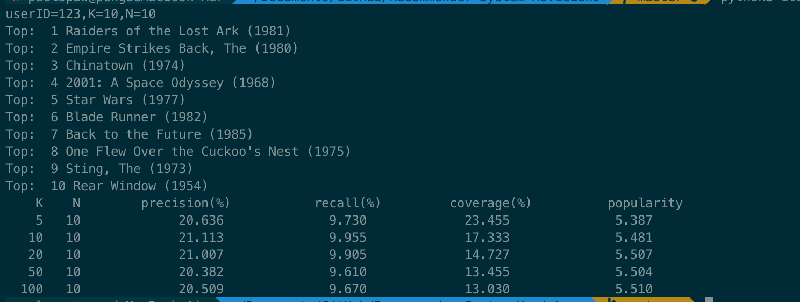
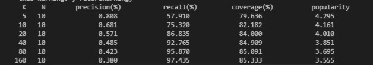
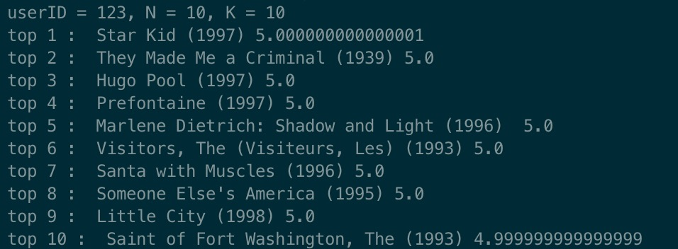

<!--
 * @Description: readme file
 * @Author: Peng LIU
 * @Date: 2019-07-27 14:03:56
 * @LastEditors: Peng LIU
 * @LastEditTime: 2019-08-11 23:32:40
 -->
# Recommender-System---MovieLens
## INTRODUCTION
#### In the early stage of this project, the user-based collaborative filtering recommendation system was established and two different algorithms were used. A lot of data processing is involved in the process of program running, and it is found that both pricision and running efficiency are not ideal. In the later stage, the item-based collaborative filtering recommendation system was introduced, and the pricision was significantly improved and shortened the operation time
## DETAILED DESCRIPTIONS OF DATA FILES
#### data.py -- A file that processes data of dataSet
#### itemBasedCF.py -- Item-based collaborative filtering recommendation system
#### euclidean.py -- User-based collaborative filtering recommendation system (method is Euclidean algorithm)
#### pearson.py -- User-based collaborative filtering recommendation system (method is Pearson algorithm)

## HOW TO RUN THE FILE 
    pip3 install -r requirements.txt
### run Item-based collaborative filtering
    python3 itemBasedCF.py
### run User-based collaborative filtering based on Euclidean algorithm
    python3 euclidean.py
### run User-based collaborative filtering based on Pearson algorithm
    python3 pearson.py

## RESULTS
### Item-based collaborative filtering
>>>
### User-basedCF based on Euclidean algorithm
>>> 
### User-basedCF based on Pearson algorithm
>>> 